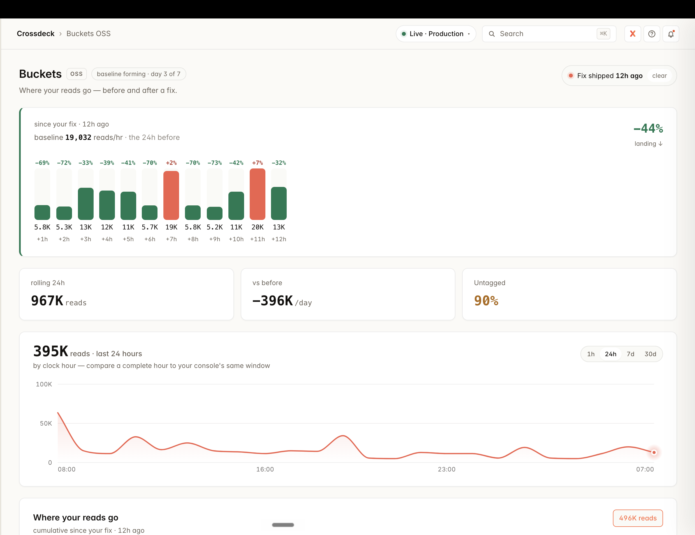

<div align="center">

# Buckets

### Know exactly what every database read costs you — and who caused it.

**Buckets is a zero-overhead cost attribution layer for your backend.**
Every read, write, and delete is cross-matched to the **function** that spent it and
the **user** who triggered it — from the identity you already have, with no blind
spots, and without ever becoming a cost itself. Work no person caused (a cron, a queue
consumer) attributes to `machine`, still by tenant. It's the one thing a query profiler
structurally cannot do: show you not just the slow query, but *whose* it was.

[](LICENSE)
[](https://www.npmjs.com/package/@cross-deck/buckets)
[](#datastore-support)
[](https://cross-deck.com)

<br/>



<sub><strong>Where your reads go — before and after a fix.</strong> 12h after a change shipped: reads down 44% (−396K/day), bars green below baseline, the curve bent. Live in every Crossdeck project.</sub>

</div>

---

## The 4am problem

You ship a feature. A week later your database bill is up 5×. Your provider's
console shows you *one number*: **9.6M reads today.** It does not tell you which
feature, which query, or whether it's user-driven or a machine. So you start guessing —
adding logs, bisecting deploys, staring at dashboards at 4am.

We lived this. On our own product, one tile was quietly issuing 15,000 reads
*per render*. It was hiding in plain sight for a day. When we finally instrumented
our read sites by hand, we *still* missed the path that mattered most — the
ingest pipeline, **1.4M reads a day, the majority of our entire bill, invisible.**

The lesson: **humans instrument what they're looking at, and miss the path that
matters.** Manual cost tracking doesn't fail loudly. It fails silently, and you
find out on the invoice.

Buckets fixes this by construction.

---

## Quickstart

### See it first — 30 seconds, no database to wire

Before instrumenting a real app, watch the readout appear from a throwaway script.
Install the package, drop in this file, run it, and read it back:

```bash
npm install @cross-deck/buckets
```

`buckets-demo.mjs`:

```js
import { init, bucket, setActor, recordReads, flush } from "@cross-deck/buckets";

init();                          // meter locally + write the readout — no key, no account
setActor("user_847");            // who's behind this request — the one-line cross-match

await bucket("analytics-dashboard", async () => recordReads(31800)); // pretend these
await bucket("pulse-map",          async () => recordReads(9400));    // came from your DB

setActor("machine");                                                  // a background job
await bucket("nightly-export",     async () => recordReads(12940));

await flush();                   // force the ~once-a-minute flush so you can look right now
```

```bash
node buckets-demo.mjs
npx @cross-deck/buckets
```

You'll see your buckets ranked biggest-first, **Who caused the reads**, and **Who ×
what — which user's which function**. That's the whole product on one screen. Now wire
it to your real database 👇

### Wire it to your app

```bash
npm install @cross-deck/buckets
```

**1. Install the meter once, at process start.** From this line on, *every*
operation on *every* code path is counted — no per-call-site work — and a coalesced
summary is reported to your Crossdeck project about once a minute. Your `cd_sk_`
secret key is all the wiring there is.

```ts
import { init, installFirestoreMeter } from "@cross-deck/buckets";
import { getFirestore, Firestore, Query, DocumentReference } from "firebase-admin/firestore";

init({ apiKey: process.env.CROSSDECK_SECRET_KEY });   // reports up to Crossdeck (~1/min)
installFirestoreMeter({ Firestore, Query, DocumentReference });   // the trap
```

That's the whole setup. The collector now sits in your path to your database,
counts in memory, and reports a tiny summary up — **it never reads your data and
never adds a query.**

**2. Name the paths that matter** with `bucket()` — every operation inside is
attributed to that name (anything you don't name still shows up, labelled by its
collection).

```ts
import { bucket } from "@cross-deck/buckets";

await bucket("pulse-map", async () => {
  const dots  = await db.collection("visitors").where("live", "==", true).get(); // → pulse-map
  const owner = await db.doc(`projects/${appId}`).get();                          // → pulse-map
});
```

**3. Read it back — one command, no dashboard.** Buckets writes a live readout to
`.crossdeck/buckets.md` (biggest bucket first). Print it with one command — a plain
file on disk, no dashboard, no account:

```bash
npx @cross-deck/buckets
```


```
# Buckets — reads on this surface
**32K reads** · 2026-06-19 (UTC)

| bucket            | named | reads |
| ----------------- | :---: | ----: |
| headline-counters |   ✓   |   31K |
| subscriptions     |   —   |  1.1K |
```

> **Seeing `No readout at .crossdeck/buckets.json`?** That's expected, not a bug. The
> file only appears once **two** things have happened: (1) your app actually *ran* and
> *read its database*, and (2) the first flush landed — buffered counts ship about once
> a minute. Run `npx` from the **same folder your app runs in** (the readout is written
> to `./.crossdeck/`). No traffic yet means nothing to show. To see it instantly without
> waiting for the timer, call `flush()` once (or wrap serverless handlers with
> `withBuckets` — [Serverless](#serverless-flush-before-you-return)).

**No Crossdeck key needed for any of that.** `init()` with no `apiKey` meters locally
and writes the readout — the free, no-account wedge. Add a key and it *also* reports
up so the same numbers surface on your dashboard, with the drill-down, before/after,
and read-spike alerts. (Set `mirror: false` to turn the local file off.)

---

## Who caused it — reads by user, by function

A query profiler shows you a slow query. It can't show you *which of your users* ran
it — it has no idea who your users are. Buckets does, because **you** do. Tell it who's
behind the request — one line, with the id already in your session — and every read
cross-matches to the person and the function that spent it:

```ts
import { setActor } from "@cross-deck/buckets";

// at your request boundary, the instant you know who it is:
setActor(req.user.id);
```

That's the whole wiring. The **function** is captured where the read runs; the **user**
from that one line. Run `npx @cross-deck/buckets` and the readout gains two sections:

```
## Who caused the reads
| user      | reads |
| user_847  |   38K |
| machine   |  115K |     ← background jobs: no person, still attributable by tenant

## Who × what — which user's which function
| user_847  | analytics-refresh | 38K |
| machine   | nightly-reconcile | 115K |
```

**Two independent axes, kept distinct.** *Who* caused the reads, and *who × which
function*. The actor wire alone splits your unattributed pile by person — how much is a
real user versus a background job — which is immediately actionable; putting clean
function names on the rest is the separate tagging work [below](#from-unknown-to-named--tagging).

**The function is the cost driver, not the page.** Reads attribute to the *operation*
that spent them — the handler or route they ran in — because one page can fire six
operations and only one is the monster. No identity on the request → a clean
`anonymous` cluster, never dropped, never guessed.

**`machine` keeps the customer.** A cron reconciling tenant data has no person — it
honestly shows as `machine` — but it still carries the tenant it ran for. You keep
per-customer cost on background work and drop *only* the person dimension, because no
person caused it.

No standalone read tool can do this — Query Insights, `pg_stat_statements`, an APM all
show you a query, never a user. In Buckets it's **free, no account.** Crossdeck (also
free until your app crosses a revenue threshold) hosts it, stitches server + browser,
and pages you when a user's reads spike.

## Serverless — wrap your handlers (or counts vanish on freeze)

Serverless platforms **freeze your container the instant a handler finishes** — to save you money they stop the CPU the moment there's no work. Buckets counts in memory and ships on a short timer; on a frozen container that timer never fires, so the operations you just ran are **billed by your datastore but missing from your dashboard.** It's worst exactly when traffic is sparse (overnight, low-volume endpoints), and it under-reports — making a bill look *smaller* than it is.

The fix is one line: wrap each serverless entry point with **`withBuckets`**. It flushes the counts in a `finally`, before the handler returns — using the split-second of CPU you've **already paid for** on that invocation. Nothing is kept awake; there is **no added cost.**

```ts
import { withBuckets } from "@cross-deck/buckets";

// before — counts can vanish when the container freezes:
export const handler = async (event) => { /* …db reads… */ };

// after — every invocation's counts ship before the freeze:
export const handler = withBuckets(async (event) => { /* …db reads… */ });

// optionally attribute the whole invocation to one bucket:
export const handler = withBuckets("nightly-export", async (event) => { /* … */ });
```

**This is adapter-agnostic.** `withBuckets` flushes the *meter*, not any one database — so a single wrap covers **every** adapter you've installed at once (Firestore, MongoDB, Postgres, …). You don't wrap per-datastore; you wrap per-handler.

Reach for it at **every** serverless entry point — HTTP and callable functions, queue/stream consumers, scheduled jobs, database triggers (AWS Lambda, Google Cloud Functions / Cloud Run, Vercel, Cloudflare Workers, …). On an always-on process (a long-running container or classic Node server) you don't need it — the timer ships your counts.

> **If you skip this on serverless, your numbers under-report on quiet traffic.** It's the one integration step that makes "catch ~99% of your reads" hold on infrastructure that sleeps — the same way calling the SDK in your handler is what makes any tool work. We can't run it for you; we make it one line and tell you plainly.

---

## Server *and* browser — install where you read

A collector counts reads **where it runs.** With Firestore, your app often reads
from **two** places: your **server** (the snippet above) and your users'
**browsers** — live `onSnapshot` listeners and direct `getDocs`/`getDoc` calls
that bill straight to your project and *never touch your server*. A server-only
collector can't see those, the same way `@cross-deck/node` can't see a browser
event. So Buckets ships a collector for each surface.

**Browser** — swap one import and add one line:

```ts
import { initBucketsWeb, bucket } from "@cross-deck/buckets/web";
// was: import { getDocs, onSnapshot } from "firebase/firestore"
import { getDocs, onSnapshot } from "@cross-deck/buckets/web";

initBucketsWeb({ apiKey: "cd_pub_live_…" }); // your PUBLISHABLE key — safe in client code

bucket("live-feed", () => onSnapshot(liveQuery, render)); // every fire counted
```

Each listener fire is counted as the documents it delivers — exactly what Firebase
bills — labelled and reported up the **same pipe**, so your dashboard shows
**server and browser reads side by side.** Install one, or both. The promise is
precise: **Buckets captures every read that flows through a collector** — put one
on each surface you read from, and you see all of it.

**Each collector stamps its environment.** Every bucket path is rooted at *where the
read ran* — `server > …` from the Node collector, `web > …` from the browser one. So a
problem bucket doesn't just tell you *which* query is bleeding, it tells you *where to go
fix it* — a backend scan or a browser listener — at a glance. Stitch both surfaces into
one Crossdeck view and a bucket fed from more than one place shows it. (Override the root
with `init({ surface })` / `initBucketsWeb({ surface })` for a more specific environment,
e.g. `dashboard`.)

> We learned this the hard way dogfooding on our own dashboard: 94% of our reads
> were browser-side and a server-only install was blind to them. The browser
> collector is the fix — and the reason "install where you read" is the whole model.

**Idempotent + React-Strict-Mode safe.** `initBucketsWeb()` only points the meter
at a sink — it never touches the count buffers (those fill from *reads*), and the
flush timer + `visibilitychange`/`pagehide` hooks sit behind one-time guards. So
calling it twice is harmless; init it wherever you init your other SDKs. One dev-only
nuance: React Strict Mode double-mounts effects, so a listener's *first* fire can be
counted twice **in dev** — production builds don't double-invoke, so your prod
numbers are exact, and your `useEffect` cleanup tears each listener down anyway.

---

## What you get

A small, cheap, daily document per app — the **rollup**. This is the entire output,
and it's a stable, public schema you can read with or without this library:

```jsonc
// costRollups/production_2026-06-18_proj_3a8f137
{
  "env": "production",
  "date": "2026-06-18",
  "appId": "proj_3a8f137",

  // who caused it → which feature → op type
  "ops": {
    "runtime":  { "pulse-map": { "read": 412000, "write": 8 },
                  "dashboard": { "read": 765000 } },
    "internal": { "reconcile": { "read": 1200, "write": 96 } }
  },

  // the fine grain: which surface / layer spent the reads
  "byLabel": {
    "server>people-feed":         { "read": 412000 },
    "server>people-journey":      { "read": 3000 },
    "server>unknown>col:events":  { "read": 21000 }
  }
}
```

Now "9.6M reads today" becomes *"765k of them are the dashboard, on the runtime
path — and within that, the people-feed layer is 137× heavier than the
journey-detail layer."* That's the difference between a number and an answer.

---

## "Did my fix work?" — the one-click loop

Buckets keeps reads at **hourly** grain for one reason: so you can ship a change
and *watch it land the same hour*, not guess from tomorrow's bill.

The loop:

1. You ship a fix to a heavy read path.
2. You click **I shipped a fix** on the dashboard. That stamps the exact moment.
3. Buckets splits the timeline there and shows the verdict in **reads / hour** —
   the hours *before* your fix vs the hours *after* it:

   ```
   since your fix · 2h ago
   1,240  →  310   reads / hour      −75%   930 fewer reads / hour · 2h observed
   ```

4. The first full hour after you click gives a real number; it settles as more
   hours land. No marker set yet? The header shows the plain day-over-day rate and
   a button to start the loop.

It is just a marker — a timestamp the dashboard remembers per project. Click it
again when you ship again (it moves to *now*); **clear** it to go back to the
day-over-day view. Nothing about the marker touches your read path or your bill;
it only changes where the dashboard draws the *before/after* line.

> Why a button and not a date field: a fix isn't a *day*, it's a *moment*. A date
> picker can't tell you whether the deploy you pushed twenty minutes ago worked —
> hourly before/after can.

---

## How it works

Three ideas, stacked. Understand these and you understand the whole library.

```
   request boundary                    every read, anywhere
        │                                       │
        ▼                                       ▼
 ┌──────────────┐    AsyncLocalStorage   ┌──────────────────┐
 │  ① THE TAG   │ ─────────────────────▶ │   ② THE TRAP     │
 │  tag once,   │     ambient context    │  patch the SDK   │
 │  at the edge │                        │  once, not your  │
 └──────────────┘                        │  call sites      │
                                         └────────┬─────────┘
                                                  ▼
                                         ┌──────────────────┐
                                         │  ③ THE METER     │
                                         │  count in memory,│
                                         │  flush ~1×/min   │
                                         └────────┬─────────┘
                                                  ▼
                                            the rollup doc
```

**① Tag once at the edge, attribute at the leaf.** Set the tag when a request
arrives; it propagates through every async fan-out automatically. Attribution
happens where the read *executes*, not where you guessed at the boundary.

**② Trap at the SDK, not at the call site.** Buckets patches the database driver's
read methods once. From then on every read is counted under the ambient tag — the
ingest job, the cron, the trigger, the path you forgot. **No blind spots, by
construction.** This is the part hand-rolled instrumentation can never get right.

**③ Count in memory, write rarely.** Counts accumulate in-process and flush to one
incremented document per (app, day) about once a minute — regardless of whether
you served 10 operations or 10 million. **The monitor never becomes the thing it
monitors.**

---

## Safe to put on your read path

Buckets patches your database driver. That demands a higher bar than most
libraries, so every wrapper is defensive by construction:

1. it calls the **real** method first and captures the result,
2. it counts inside a `try/catch` that **cannot throw into your code**,
3. it **always returns the real result, untouched.**

It physically cannot break a read, change a result, or add latency beyond a single
in-memory counter increment. If a count is ever wrong, it's a *measurement* error —
never a correctness or availability one. Install is idempotent. A failed flush
drops one window of counts rather than risk corrupting anything.

> Buckets is observability, not a transactional ledger. It is built to be wrong
> by a rounding error under catastrophe, and never, ever to take your app down.

| Guarantee | How |
|---|---|
| **Every read is caught** | SDK-level trap — no read on any path is ever uncounted or silent |
| **Every read is labeled** | Path-based cascade always tags the collection + project, even untagged |
| **Untagged is loud, never hidden** | Reads outside a tagged context surface as `unknown` coverage — surfaced, never dropped |
| **Never a cost driver** | In-memory buffers, ~1 write/min per app, tiny daily docs |
| **Never breaks a read** | Real-method-first · count-in-try/catch · always-return-untouched |
| **Concurrency-safe** | Atomic increments; snapshot-and-clear before each flush |
| **Honest under failure** | A dropped flush loses a window, never double-counts |

### What "no blind spots" actually means

Be precise, because the difference matters: **the trap guarantees every read is
*caught* and labeled by its collection — none is ever silent.** Sorting a read into
a named *function* (`analytics-refresh`) comes from an explicit `bucket()` — or the
SDK's autocaptured operation — and the *user* from `setActor` at the request boundary.
A read that runs outside any of that is still caught and still labeled by collection
(`col:events`) and project — it simply lands in **`unknown`** (and `anonymous`) until
you name that entry point.

`unknown` is **first-class and loud**, never folded away and never filtered out of
the surface. A growing `unknown` bucket is the meter telling you "there's a real
read path here you haven't tagged yet" — which is exactly the signal you want, and
the opposite of a blind spot. Tag the entry point and it resolves into a named
feature. The one thing that never happens is a read going *uncounted*.

---

## From `unknown` to named — tagging

The trap catches every read for free and labels it by collection (`col:events`) —
that answers *what's being read.* Buckets becomes genuinely useful the moment you
**name the read path yourself** — wrap it in a bucket:

```ts
import { bucket } from "@cross-deck/buckets";

// every read inside here is attributed to "nightly-export"
await bucket("nightly-export", async () => {
  const rows = await db.collection("events").where("exported", "==", null).get();
  // …
});
```

From the next read on, that path reports as `nightly-export` instead of `col:events`.

> **Tagging applies going forward, not backward.** Buckets never rewrites counts
> that already happened — a count is a fact at the moment it occurs. So after you
> ship a tag you will **not** see the old `col:events` bucket rename itself. You'll
> see a **new `nightly-export` bucket appear and grow** as fresh reads land, while
> the unnamed bucket stops climbing. The next full day shows the path named from its
> first hour. (Watch for the *new* name appearing — not the old bar changing colour.)

> **Tagged it, but it's *still* showing untagged? You tagged the wrong path.** The
> check after you ship is one thing: did your new name start growing while the
> `col:*` / `unknown` bucket stopped climbing? If instead the **untagged bucket keeps
> climbing and your name never grows**, the reads aren't flowing through the code you
> wrapped. Remember the collection tells you *what* is read, not *where* — and the
> same collection is usually read from several places. Re-evaluate which path actually
> issues those reads and tag *that* one. A tell: a smooth, constant rhythm (especially
> with nobody using the app) is a **machine** — a scheduled job or per-event
> processing — not a person; a spiky, daytime pattern is user-driven. Let the shape
> point you at the right path.

See an `unknown` bucket you can't explain? **Drill in, wrap that path in a
`bucket()`, ship, look again** — and keep going, coarse to fine, until the read is
named all the way down to the line you care about. Two grains:

- **Tag a bucket** (coarse) — a whole handler or job: `bucket("pulse-map", handler)`
- **Tag a single read** (fine) — one query: `bucket("owner-lookup", () => db.doc(id).get())`

**Nest to drill down.** A `bucket()` inside another **composes into a path** —
the dashboard reads that path as a tree, so you tag the biggest bucket, see what's
under it, tag *that*, and the next-biggest surfaces. A tagged bucket also keeps the
collection it read as the leaf, so you never lose where the units actually went:

```ts
await bucket("analytics", () =>
  bucket("rollup", () => db.collection("events").where(/*…*/).get()));
// → "analytics > rollup > col:events"
```

That waterfall — tag, drill, tag again — is how you walk a bill down from "where's
it all going?" to the exact line, one ship at a time.

`unknown` is never a dead end. It's a to-do with a one-line fix — exactly like a
custom analytics event you haven't named yet. You tag until you've found your
source; the new names appear as fresh reads land, and the next full day starts
fully named.

**Not sure where to start? Ask your database.** Before you guess at what to tag,
your datastore already ranks its own most expensive reads for you. On Firestore,
open the Firebase console → **Firestore → Query Insights**: it lists your top
queries by read volume, the collection each one hits, and how many documents each
scan touches — a tagging to-do list, sorted by cost. (MongoDB: Atlas Performance
Advisor / `$queryStats`. Postgres: `pg_stat_statements`.) Find the heaviest query
there, find the code path that issues it, wrap *that* in a `bucket()` — and you've
named your single most expensive read first, on the first ship.

---

## What Buckets is — and what it deliberately isn't

Buckets is **telemetry, done right.** It tells you *what* your costs are and
*exactly where they come from.* It does **not** tell you *why* a number changed or
*what to do about it* — and that restraint is intentional.

The labels Buckets emits are deliberately low-level: the collection, the function,
the user, the count. **It will never write an interpretation** — no
`scan-on-load`, no `regression`, no `anomaly`. Those are judgements, and judgement
is a separate concern that lives in a separate layer.

We think that's the honest line. Collection should be a free, open, commodity
primitive that the whole ecosystem can build on — so we open-sourced it, and we
publish the rollup schema so you can consume it with any tool you like, including
your own. **The best place to read Buckets data should be earned, never locked.**

### Free with the collector — and what Crossdeck adds

The collector is yours, free, forever: it meters every read on the surface you put
it on, never costs you reads to *run*, and you can point it at your own sink and read
the raw numbers yourself. That's a real tool on its own.

Two honest limits come with going it alone — and they're exactly what Crossdeck is for:

- **You see the surface you installed on.** Drop it in your server and you see server
  reads — often the *minority*. Most apps read from the browser too (a separate
  install), and the bill is the sum of both. **Crossdeck stitches server + browser +
  every surface into one number**, so you stop reasoning from a slice — and shows you
  **which environment each bucket bleeds from** (server vs browser vs dashboard,
  colour-coded), so you know where to go fix it. That per-environment view is **free**
  the moment you register and install the SDK — additional functionality, still no cost.
- **Reading the numbers back yourself costs a few reads** — querying your own stored
  rollups is still a read. **Crossdeck maintains the summary and serves it to you free,
  live, any time** — the cost tool never costs you to look.

And because it's already wired in, Crossdeck turns the raw meter into the thing you
*act* on: the **drill-down** (tag → see the next-biggest → tag again, down to the
line), the **before/after fix verdict**, a **7-day baseline**, and **Slack alerts that
page you before the invoice**. The numbers are identical on both sides — same counts,
same source — Crossdeck just makes them whole, free to read, and impossible to miss.

Getting there is one step you were taking anyway: **onboard, install the SDK once, and
read-cost comes with it** — no second setup.

### Cost should page you like an exception — not surprise you like an invoice

You already know what your code *should* do. You wrote the analytics pipeline; you
know it should read ~20k times a day, not 2M. The problem has never been a lack of
knowledge — it's that when reality departs from what you know, **nothing tells
you.** You find out at month-end, on a bill that's already due.

That's the difference between the two developers who hit the same bug. One reviews
the console at the end of the month and finds read volume that's been running ~100×
normal for weeks — a *verdict*, already billed, no cause attached. The other gets a
message ninety seconds in — *"analytics is at 2M reads, expected 20k"* — opens the
dashboard, sees which bucket, knows the code, and ships the fix before lunch. The
spike never gets a month to run. Same bug. The only difference is *when they found
out*.

A report is something you remember to open. An error is something that finds you.
Buckets gives you the open measurement that makes the difference possible — every
read attributed, in real time, with no blind spots.

### Get paged in Slack before the bill is in the post

This is the part that turns Buckets from a dashboard you remember to open into a
system that *finds you*. Connect Slack to [Crossdeck](https://cross-deck.com) and it
watches your buckets for you:

1. **It learns your normal.** For ~7 days it quietly builds a baseline of what each
   hour looks like — *per hour-of-day*, so a busy 2pm is judged against other 2pms,
   never against 3am. No alerts during this; it's collecting.
2. **It follows your fixes.** The baseline is recency-weighted: arrive bleeding 2M
   reads, fix down to 50k, and it forgets the 2M and settles at your new normal. So
   a later 50k→500k spike is a *real* deviation, not lost under an old number.
3. **It pings only on a real surge.** When a completed hour breaks the baseline (a
   big statistical jump *and* a meaningful multiple — both gates, so a tiny bucket
   jittering never pages you), you get a Slack message:
   > 🟡 **Read spike detected** — *512,000 reads* in the last hour, about *10×* your
   > normal for this time of day (~50,000). Open Buckets to see which bucket moved.
4. **You stay in control.** Shipped a feature you *know* adds reads? One click —
   **"Expected — quiet for 24h"** — and it hushes while the baseline re-bases. Your
   knowledge of your own roadmap is the final authority; it never pretends to know
   better.

An ongoing spike pings **once**, not every hour. Cold-start means it never cries
wolf before it knows you. And — the rule that holds the whole system together — the
thing that watches your read bill **never runs one up**: every check reads a small
maintained summary, never scans your data.

> The open collector in this repo produces the buckets. The baseline, the anomaly
> detection, and the Slack alert are the layer [Crossdeck](https://cross-deck.com)
> builds on top. The collector stands alone, free, forever — Crossdeck is where the
> buckets start paging you.

---

## Counting model

| Operation | Counted as |
|---|---|
| Query returning N docs | N reads |
| Empty query | 1 read *(your provider bills a minimum of one)* |
| `doc.get()` | 1 read |
| `getAll(...refs)` | one read per ref |
| `onSnapshot` fire (server + browser) | the docs that fire delivered |
| `count()` / aggregation | ~`ceil(matched / 1000)` reads *(honest estimate — Firestore doesn't expose the exact index-entry count)* |
| Write / delete | 1 each |

Counts are **defensible** — every one traces to a billed operation, so the rollup
reconciles against your provider's invoice instead of drifting from it.

---

## One model: resource units

Buckets doesn't really measure "reads and writes." It measures **resource units** —
the raw quantity of whatever a service charges you for. Firestore happens to charge
in reads, writes, and deletes, so those are its units. Other sources charge
differently, and each gets its own units:

| Source | Resource units |
|---|---|
| **Firestore** | `read`, `write`, `delete` |
| ClickHouse | `clickhouse.query_ms`, `clickhouse.bytes_scanned` |
| Redis | `redis.memory_mb` |
| Cloudflare Workers | `cloudflare.invocations` |
| OpenAI | `openai.tokens` |

Two rules keep this honest, and they are the whole of the discipline:

1. **Every resource keeps its own identity and its own unit.** A `read` is a read; a
   `clickhouse.query_ms` is a query-millisecond. They are stored and shown on
   **separate lines** and are **never added together** — there is deliberately no
   "total units" number, because adding a read to a query-millisecond is meaningless.
2. **Raw counts only — no money.** Buckets never multiplies units by a price or
   guesses a dollar figure. It tells you *how much of each unit* a feature consumed;
   you verify the cost against your provider's bill, which is the only source of
   truth for money. (Prices change by plan, region, and date; the count doesn't.)

Every adapter — present and future — does the same thing: `record(resource, quantity)`
under a `bucket()`. Same model, many sources. That's why adapters are named for the
**source**, not the database: Buckets answers *"what did feature X consume,"* and
Firestore is simply the first place it found the leak.

---

## Datastore support

| Datastore | Unit measured | Status |
|---|---|---|
| **Firestore / Firebase — server** (`firebase-admin`) | reads | ✅ Supported |
| **Firestore / Firebase — browser** (`firebase` JS SDK) | reads | ✅ Supported — `@cross-deck/buckets/web` |
| **MongoDB** (`mongodb` driver, incl. Atlas) | documents read | ✅ Supported — `installMongoMeter` |
| **Postgres** (`pg` driver) — incl. Supabase, Neon, Vercel Postgres, RDS | rows read | ✅ Supported — `installPgMeter` |
| DynamoDB · Cosmos · Redis | (per-source unit) | 🔜 Adapter interface is public — contributions welcome |

Each adapter measures its source's **raw unit** — never a dollar bill. Firestore
counts reads; MongoDB counts the documents your queries return; Postgres counts the
rows your queries return. (Supabase, Neon, and RDS bill by compute — instance size ×
hours, not per row — so "rows read" is the read *load* by feature: the work that
sizes your instance and the place to optimise, not your invoice.)

### MongoDB

Same model as Firestore: install the trap once, name your paths with `bucket()`.
Pass the driver classes from your `mongodb` import (an optional peer dep):

```ts
import { FindCursor, AggregationCursor, Collection } from "mongodb";
import { installMongoMeter, bucket } from "@cross-deck/buckets";

installMongoMeter({ FindCursor, AggregationCursor, Collection });   // once, at startup

await bucket("home-feed", async () => {
  const posts = await db.collection("posts").find({ live: true }).toArray(); // → home-feed
});
```

Every `find().toArray()`, `aggregate().toArray()` and `findOne()` is counted as the
documents it returns, attributed to the bucket — observe-only (it reads the result
already in hand, runs no `explain()` and no profiler scan, so it never becomes a read
monster). The dashboard shows it in MongoDB's own language ("docs read").

### Postgres — Supabase, Neon, Vercel Postgres, RDS

One adapter covers node-postgres (`pg`) and everything built on it — Supabase, Neon,
Vercel Postgres, Amazon RDS, and plain Postgres. Install the trap once; name your
paths with `bucket()`. Pass the `Client` class from your `pg` import (an optional peer
dep):

```ts
import { Client } from "pg";
import { installPgMeter, bucket } from "@cross-deck/buckets";

installPgMeter({ Client });   // once, at startup

await bucket("billing-page", async () => {
  const { rows } = await pool.query("SELECT * FROM invoices WHERE user_id = $1", [id]); // → billing-page
});
```

Every `SELECT` is counted as the rows it returns, attributed to the bucket. One patch
on `Client` covers a `Pool` too — `pool.query()` runs through the same client, so
there's no double counting. Observe-only: it reads `result.rows` already in hand, runs
no `EXPLAIN` and no `pg_stat_statements` scan, so it never becomes a read monster.
Writes (`INSERT`/`UPDATE`/`DELETE`, even with `RETURNING`) are not reads and are not
counted. The dashboard shows it in Postgres's own language ("rows read").

---

## API

```ts
init({ apiKey, endpoint?, flushIntervalMs? })   // configure once; reports up to Crossdeck

bucket(name, fn)               // ← the one verb you'll use: attribute everything inside to `name`
setActor(userId)               // WHO — attribute reads to the user you already have in session
withBuckets(handler)           // wrap a serverless handler — flush its counts before the freeze
withBuckets(name, handler)     // …and attribute the whole invocation to `name`

installFirestoreMeter(classes) // Firestore (server) — pass your firebase-admin classes
installMongoMeter(classes)     // MongoDB — pass your mongodb driver classes
installPgMeter(classes)        // Postgres (incl. Supabase, Neon, RDS) — pass your pg Client
flush()                        // force a flush (tests / shutdown)

// lower-level, if you need it:
runWithCostTag(tag, fn) · enterCostTag(tag) · refineCostTag(patch) · currentCostTag()
recordReads(n) · recordWrites(n) · recordDeletes(n)
```

One import to set up, one call to install, one verb to name a path. That's the
whole footprint. The reporting (collector → `POST /v1/buckets/report` → your
maintained rollup → dashboard) happens automatically — you never touch it.

---

## Serverless: flush before the function returns

Buckets counts reads in memory and ships them to your rollup on a timer
(`flushIntervalMs`, ~once a minute). That's exactly right for a long-lived server.
But **serverless runtimes — Cloud Functions, Lambda, Vercel, Cloud Run — _freeze_
the container the instant your handler returns.** A frozen container runs no
timers and fires no `beforeExit`, so any counts buffered since the last tick are
paused with it — and on a short invocation that finishes in under a minute, they
are **never shipped.** The reads happened and your provider billed them, but
Buckets never saw the window. That is a blind spot, and a blind spot is the one
thing this library promises not to have.

The fix is one wrapper — **`withBuckets`.** It flushes the meter once, in a
`finally`, before your function returns — on success and on throw alike (the reads
happened either way). It's transparent: it forwards every argument and `this`,
returns your handler's value unchanged, re-throws your handler's error unchanged,
and a flush fault can never escape into your app.

```ts
import { withBuckets } from "@cross-deck/buckets";

// every read inside is counted AND shipped before the container freezes
export const handler = withBuckets(async (event) => { /* …your db reads… */ });

// optionally attribute the whole invocation to one bucket:
export const handler = withBuckets("nightly-export", async (event) => { /* … */ });
```

Prefer not to wrap? Call `flush()` yourself in a `finally` — same guarantee, one
more line:

```ts
import { flush } from "@cross-deck/buckets";

export const handler = async (event) => {
  try { return await doWork(event); }
  finally { await flush(); }   // ship this invocation's counts before the freeze
};
```

Rule of thumb: **if the runtime freezes or exits between invocations, call
`flush()` in a `finally` at the edge of every handler** — scheduled jobs, queue
consumers, HTTP and callable functions alike. On an always-on process (a container
or classic Node server that stays up), the timer handles it and you don't need to.

---

## Roadmap

- [x] Core: tag · trap · meter · rollup
- [x] Firestore adapter (server + browser)
- [x] MongoDB adapter
- [x] Postgres adapter (incl. Supabase, Neon, RDS)
- [x] Public, versioned rollup schema
- [ ] DynamoDB · Cosmos · Redis adapters (the adapter interface is public — contributions welcome)
- [ ] `compute` (invocation + CPU-ms) attribution in the public build
- [ ] OpenTelemetry export
- [ ] Community sink adapters (BigQuery, ClickHouse, S3)

The *intelligence* on top of these rollups — regression detection, deploy
attribution, forecasting, suggested fixes — is **not** on this roadmap by design.
That's the line between the open primitive and the product built on it.

---

## FAQ

**Is this really free, or is there a catch?**
No catch — and that includes Crossdeck itself. The collector and the schema are
MIT, free forever; **and seeing your numbers on Crossdeck is free too**, on a
genuinely generous free tier. We never charge you to watch your own read costs —
there's no trial clock, no paywall, no "upgrade to see your data." This isn't a
funnel dressed up as open source. Your rollups are yours — in your datastore,
readable by anything, with or without us. Crossdeck earns its keep on the broader
platform you can grow into, never on locking up the cost data you already own.

**Won't patching the SDK slow down my reads?**
No. The overhead is one in-memory map increment per read. No I/O is added to the
read path; writes happen in a batched flush roughly once a minute.

**What if Buckets crashes or its sink is down?**
Your reads are unaffected — every wrapper returns the real result no matter what
happens inside the meter. You lose at most one ~60-second window of *counts*.

**Why not just read my cloud provider's billing export?**
Billing exports tell you the total. They can't tell you *which function* or *which
user* — the attribution that lets you actually fix the cost. That's the entire point
of Buckets.

**Does it work with `firebase-functions` / serverless cold starts?**
Yes. The meter flushes on `SIGTERM` and `beforeExit`, so a scaling-to-zero
instance writes its final window before it dies.

---

## Contributing

Adapters, tests, and docs are the highest-leverage contributions. The bar for
anything touching the read path is the safety contract above — real-method-first,
never-throws, always-returns-untouched, with a test that proves it. See
[CONTRIBUTING.md](CONTRIBUTING.md).

## Who's behind this

Buckets is built and battle-tested by **[Crossdeck](https://cross-deck.com)** —
revenue, analytics, identity, and cost intelligence for app developers. We run
Buckets in production on every read our own platform serves. If it's good enough
to protect our invoice, it's good enough for yours.

## License

[MIT](LICENSE). Use it anywhere, including commercially. No attribution required
(though a ⭐ is always appreciated).

<div align="center">
<br>
<strong>Stop guessing what your database costs. Start knowing.</strong>
<br><br>
<code>npm install @cross-deck/buckets</code>
</div>
